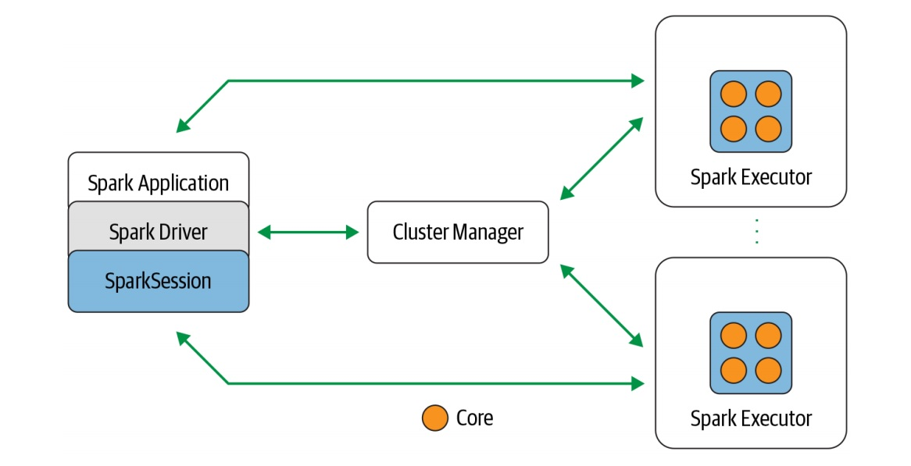
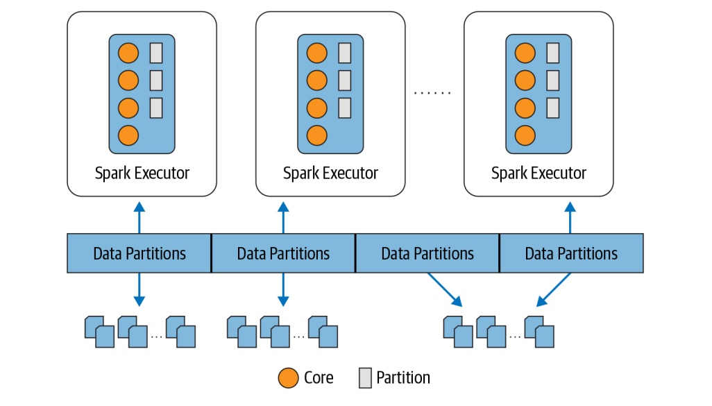

[<-----](https://github.com/s1tcomsfan/knowledge_warehouse/blob/main/Spark/contents.md)

## Spark’s design philosophy centers around **four key characteristics**:

* **Speed** 
    * distributed processing of data in clusters of sercvers
    * intermediate results retained in memory and its limited disk I/O
    * decomposing of queries into tasks that are executed in parallel across workers
    * SQL optimization

* **Ease of Use** - providing a fundamental abstraction of a simpke logical data structure called a ***Resilient Distributed Dataset (RDD)*** upper wich all other higher-level structured data abstractions, such as ***DataFrames and Datasets***, are constructed and set of ***transformations and actions as operations***.

* **Modularity** - Spark operations expressed in any of the ***supported programming languages: Scala, Java, Python, SQL, R***. Spark offers unified libraries with well-documented APIs that include the following modules as ***core components: Spark SQL, Spark Structured Streaming, Spark MLlib, and GraphX***, combining all the workloads running under one engine.

* **Extensibility** - you can use Spark to read data stored in myriad sources — ***Apache Hadoop, Apache Cassandra, Apache HBase, MongoDB, Apache Hive, RDBMSs***, and more—and process it all in memory. Spark’s DataFrameReaders and DataFrame Writers can also be extended to read data from other sources, such as ***Apache Kafka, Kinesis, Azure Storage, and Amazon S3***, into its logical data abstraction, on which it can operate.

## Apache Spark Components

* **Spark SQL** - this module works well with structured data. You can read data stored in an RDBMS table or from file formats with structured data (CSV, text, JSON, Avro, ORC, Parquet, etc.) and then construct permanent or temporary tables in Spark. Also, when using Spark’s Structured APIs in Java, Python, Scala, or R, you can combine SQL - like queries to query the data just read into a Spark DataFrame.

* **Spark MLlib** - provides many popular machine learning algorithms built atop high-level DataFrame-based APIs to build models. Starting with Apache Spark 1.6, the MLlib project is split between two packages: ***spark.mllib*** and ***spark.ml***. These APIs allow you to extract or transform features, build pipelines (for training and evaluating), and persist models (for saving and reloading them) during deployment. Additional utilities include the use of common linear algebra operations and statistics. MLlib includes other low-level ML primitives, including a generic gradient descent optimization.

* **Spark Structured Streaming** - necessary for big data developers to combine and react in real time to both static data and streaming data from engines like Apache Kafka and other streaming sources, the new model views a stream as a continually growing table, with new rows of data appended at the end. Developers can merely treat this as a structured table and issue queries against it as they would a static table.

* **GraphX** - library for manipulating graphs (e.g., social network graphs, routes and connection points, or network topology graphs) and performing graph-parallel computations. It offers the standard graph algorithms for analysis, connections, and traversals.

## Components and architecture

* **Spark driver** - as the part of the Spark application responsible for instantiating a SparkSession, the Spark driver has multiple roles: it communicates with the cluster manager; it requests resources (CPU, memory, etc.) from the cluster manager for Spark’s executors (JVMs); and it transforms all the Spark operations into DAG computations, schedules them, and distributes their execution as tasks across the Spark executors. Once the resources are allocated, it communicates directly with the executors.

* **SparkSession** - unified conduit to all Spark operations and data, provides a single unified entry point to all of Spark’s functionality.

* **Cluster manager** - responsible for managing and allocating resources for the cluster of nodes on which your Spark application runs. Currently, Spark supports four cluster managers: ***the built-in standalone cluster manager, Apache Hadoop YARN, Apache Mesos, and Kubernetes***.

* **Spark executor** - runs on each worker node in the cluster. The executors communicate with the driver program and are responsible for executing tasks on the workers. In most deployments modes, only a single executor runs per node.

## Distributed data and partitions

Actual physical data is distributed across storage as partitions residing. While the data is distributed as partitions across the physical cluster, Spark treats each partition as a high-level logical data abstraction — as a DataFrame in memory. Though this is not always possible, each Spark executor is preferably allocated a task that requires it to read the partition closest to it in the network, observing **data locality**.

## Popular Spark use cases

* Processing in parallel large data sets distributed across a cluster
* Performing ad hoc or interactive queries to explore and visualize data sets
* Building, training, and evaluating machine learning models using MLlib
* Implementing end-to-end data pipelines from myriad streams of data
* Analyzing graph data sets and social networks

[<-----](https://github.com/s1tcomsfan/knowledge_warehouse/blob/main/Spark/contents.md)

