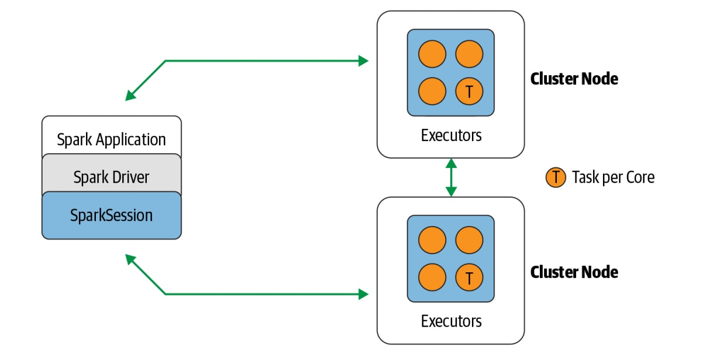
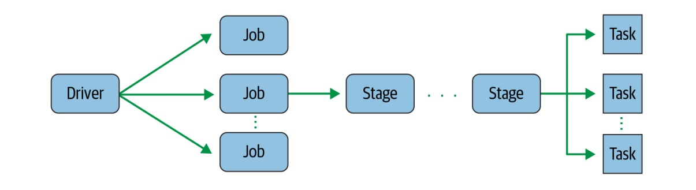
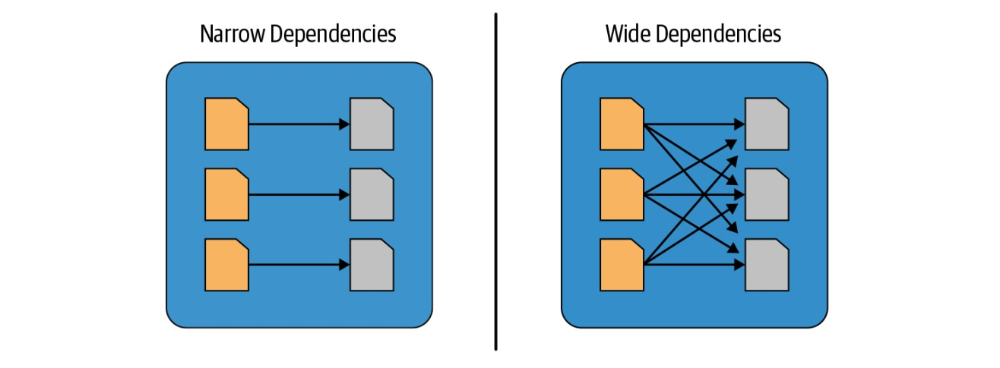

[<-----](https://github.com/s1tcomsfan/knowledge_warehouse/blob/main/Spark/contents.md)

## Spark application concepts

* **Application** - a user program built on Spark using its APIs. It consists of a driver program and executors on the cluster.

* **SparkSession** - an object that provides a point of entry to interact with underlying Spark functionality and allows programming Spark with its APIs. In an interactive Spark shell, the Spark driver instantiates a SparkSession for you, while in a Spark application, you create a SparkSession object yourself. When you’re working with a Spark shell, the driver is part of the shell and the SparkSession object (accessible via the variable spark) is created for you.

* **Job** - a parallel computation consisting of multiple tasks that gets spawned in response to a Spark action (e.g., save(), collect()). During interactive sessions with Spark shells, the driver converts your Spark application into one or more Spark jobs. It then transforms each job into a ***Directed Acyclic Graph (DAG)***. This, in essence, is Spark’s execution plan, where each node within a DAG could be a single or multiple Spark stages.

* **Stage** - each job gets divided into smaller sets of tasks called stages that depend on each other. As part of the DAG nodes, stages are created based on what operations can be performed serially or in parallel. Not all Spark operations can happen in a single stage, so they may be divided into multiple stages. Often stages are delineated on the operator’s computation boundaries, where they dictate data transfer among Spark executors.

* **Task** - a single unit of work or execution that will be sent to a Spark executor. Each stage is comprised of Spark tasks (a unit of execution), which are then federated across each Spark executor; each task maps to a single core and works on a single partition of data

### Transformations, Actions, and Lazy Evaluation

Spark operations on distributed data can be classified into two types: ***transformations and actions***. Transformations, as the name suggests, transform a Spark DataFrame into a new DataFrame without altering the original data, giving it the property of ***immutability***. 

All ***transformations are evaluated lazily***. That is, their results are not computed immediately, but they are recorded or remembered as a lineage. A recorded ***lineage*** allows Spark, at a later time in its execution plan, to rearrange certain transformations, coalesce them, or optimize transformations into stages for more efficient execution. Lazy evaluation is Spark’s strategy for delaying execution until an action is invoked or data is “touched” (read from or written to disk). An ***action triggers the lazy evaluation*** of all the recorded transformations.

While ***lazy evaluation*** allows Spark to optimize your queries by peeking into your chained transformations, ***lineage and data immutability provide fault tolerance***. Because Spark records each transformation in its lineage and the DataFrames are immutable between transformations, it can reproduce its original state by simply replaying the recorded lineage, giving it resiliency in the event of failures.

**Transformations nad actions as Spark operations**
| Transformations | Actions |
| --------------- | ------- |
| orderBy() | show() |
| groupBy() | take() |
| filter() | count() |
| select() | collect() |
| join() | save() |

***

**Narrow Transformations** - any transformation where a single output partition can be computed from a single input partition (filter(), contains(), etc.).

**Wide Transformaitons** - trnsformaitons with using of data from other partitions (groupBy(), orderBy(), etc.).

***

### Spark UI

Spark includes a **graphical user interface** that you can use to inspect or monitor Spark applications in their various stages of decomposition—that is jobs, stages, and tasks. Depending on how Spark is deployed, the driver launches a web UI, running by default on port 4040, where you can view metrics and details such as:

* A list of scheduler stages and tasks
* A summary of RDD sizes and memory usage
* Information about the environment
* Information about the running executors
* All the Spark SQL queries

[<-----](https://github.com/s1tcomsfan/knowledge_warehouse/blob/main/Spark/contents.md)