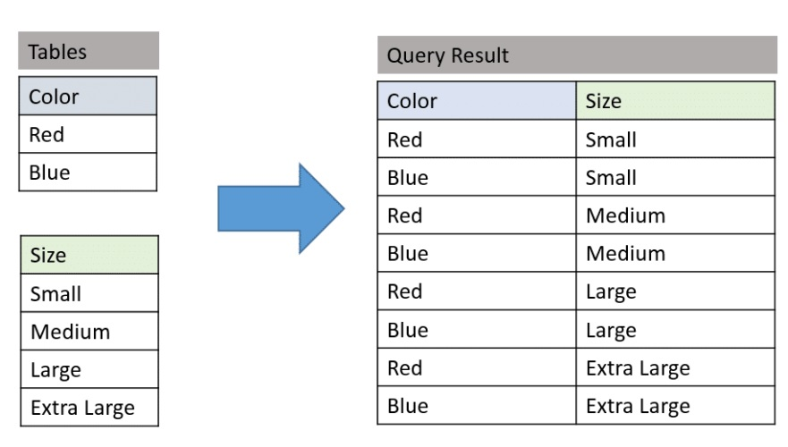

[<-----](https://github.com/s1tcomsfan/knowledge_warehouse/blob/main/databases/SQL/contents.md)

# Джоины

Таблицы для примеров: пользователи и отделы

u) users
id | name | d_id
-- | ---- | ----
1 | Владимир | 1
2 | Антон | 2
3 | Александр | 6
4 | Борис | 2
5 | Юрий | 4

d) departments
id | name
-- | ----
1 | Сейлз
2 | Поддержка
3 | Финансы
4 | Логистика

## INNER JOIN

Выбираются только совпадающие данные из объединяемых таблиц. Синоним JOIN, ключевое слово INNER можно опустить.


```
SELECT u.id, u.name, d.name AS d_name
FROM users u
INNER JOIN departments d ON u.d_id = d.id
```

Результаты:

id | name | d_name
-- | ---- | ------
1 | Владимир | Сейлз
2 | Антон | Поддержка
4 | Борис | Поддержка
3 | Юрий | Логистика

В результатах отсутствуют:
- пользователь Александр (отдел 6 - не существует)
- отдел Финансы (нет пользователей)

## LEFT (OUTER) JOIN

Вернет все элементы из левой таблицы, объединит их с данными из правой таблицы (по условию объединения) и дополнит недостающие значения NULL.


```
SELECT u.id, u.name, d.name AS d_name
FROM users u
LEFT (OUTER) JOIN departments d ON u.d_id = d.id
```

Результаты:

id | name | d_name
-- | ---- | ------
1 | Владимир | Сейлз
2 | Антон | Поддержка
3 | Александр | NULL
4 | Борис | Поддержка
3 | Юрий | Логистика

Чтобы исключить пересекающиеся элементы можно добавить условие:

```
WHERE d.id IS NULL
```


## RIGHT (OUTER) JOIN

Аналогичный LEFT JOIN только за основу берется правая таблица. Взаимозаменяемы, нужно лишь поменять таблицы местами. 

table_a LEFT JOIN table_b == table_b RIGHT JOIN table_a

## FULL (OUTER) JOIN

Оператор полного внешнего соединения. В результат добавляются:

1) Внутреннее соединение INNER JOIN
2) Строки первой таблицы, которые не вошли во внутреннее соединение. Соответствующие строки второй таблицы заполняются NULL
3) Строки второй таблицы, которые не вошли во внутреннее соединение. Соответствующие строки первой таблицы заполняются NULL


Чтобы исключить пересекающиеся элементы можно добавить условие:

```
WHERE d.id IS NULL
```


## CROSS JOIN

Оператор перекрёстного соединения, или декартова произведения: каждая строка одной таблицы соединяется с каждой строкой второй таблицы, получаем все возможные сочетания строк двух таблиц.



[<-----](https://github.com/s1tcomsfan/knowledge_warehouse/blob/main/databases/SQL/contents.md)


